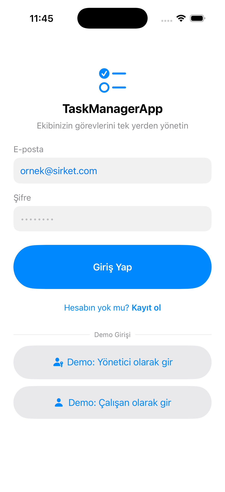

# TaskManagerApp

SwiftUI ile yazılmış, yönetici/çalışan rollerine göre çalışan bir görev takip prototipi. Uygulamanın asıl odağı; görevleri alt görevlere (subtask) bölüp, ilerlemeyi otomatik olarak takip etmek.



## Özellikler

- **Rol bazlı iki arayüz**: Yönetici yatay kaydırmalı kanban panosu (Yapılacak / Devam Ediyor / Tamamlandı) görür; çalışan kendi görevlerinin listesini, swipe ile durum değiştirme imkanıyla görür.
- **Alt görev (subtask) takibi**: Her görev alt görevlere bölünebilir, tamamlanma oranı ilerleme çubuğuyla gösterilir.
- **Otomatik durum senkronu**: Alt görevler işaretlendikçe görevin genel durumu otomatik güncellenir — ilk alt görev işaretlenince "Devam Ediyor", hepsi tamamlanınca "Tamamlandı" olur; geri alınırsa durum da geri düşer.
- **Görev oluşturma / silme**: Yönetici yeni görev açabilir (başlık, açıklama, atanan kişi, son tarih, alt görevler), mevcut görevi silebilir.
- **Kalıcılık**: Görevler JSON olarak cihazda saklanır, uygulama kapatılıp açılsa da veri korunur.
- **Demo giriş**: Gerçek kimlik doğrulama henüz eklenmedi — "Demo: Yönetici" / "Demo: Çalışan" butonlarıyla ilgili role giriş yapılır.

## Mimari

```
TaskManagerApp/
├── Models/         Saf veri tipleri (AppUser, TaskItem, Subtask, TaskStatus)
├── ViewModels/     TaskStore — @Observable tek doğruluk kaynağı + JSON kalıcılık
└── Views/
    ├── Auth/       LoginView, SignUpView (demo/stub)
    ├── Manager/    ManagerBoardView (kanban), CreateTaskView
    ├── Employee/   EmployeeTaskListView (liste + swipe actions)
    └── Shared/     TaskCardView, TaskDetailView
```

`TaskStore`, Swift'in `@Observable` makrosuyla işaretli tek bir sınıf; `RootView` bunu `.environment(store)` ile enjekte eder, tüm ekranlar aynı store'u okur/yazar. Böylece bir ekrandaki değişiklik (örn. subtask işaretleme) diğer tüm ekranlara anında yansır.

## Gereksinimler

- Xcode 16+
- iOS 17+ (simülatör veya cihaz)

## Çalıştırma

```bash
open TaskManagerApp.xcodeproj
```

Xcode açıldıktan sonra bir simülatör seçip `Cmd+R` ile çalıştırın. Giriş ekranında **Demo: Yönetici olarak gir** ya da **Demo: Çalışan olarak gir** ile devam edin.

## Test

Proje, alt görev/durum senkronunu uçtan uca doğrulayan bir XCUITest içerir:

```bash
xcodebuild -project TaskManagerApp.xcodeproj -scheme TaskManagerApp \
  -destination 'platform=iOS Simulator,name=iPhone 17 Pro' test
```

ya da Xcode içinden `Cmd+U`.

## Bilinen sınırlamalar

- Login/SignUp ekranları görsel olarak var ama işlevsiz; gerçek kimlik doğrulama henüz eklenmedi.
- Kullanıcı/çalışan listesi mock veriden (`MockData.swift`) geliyor, dinamik kullanıcı yönetimi yok.
